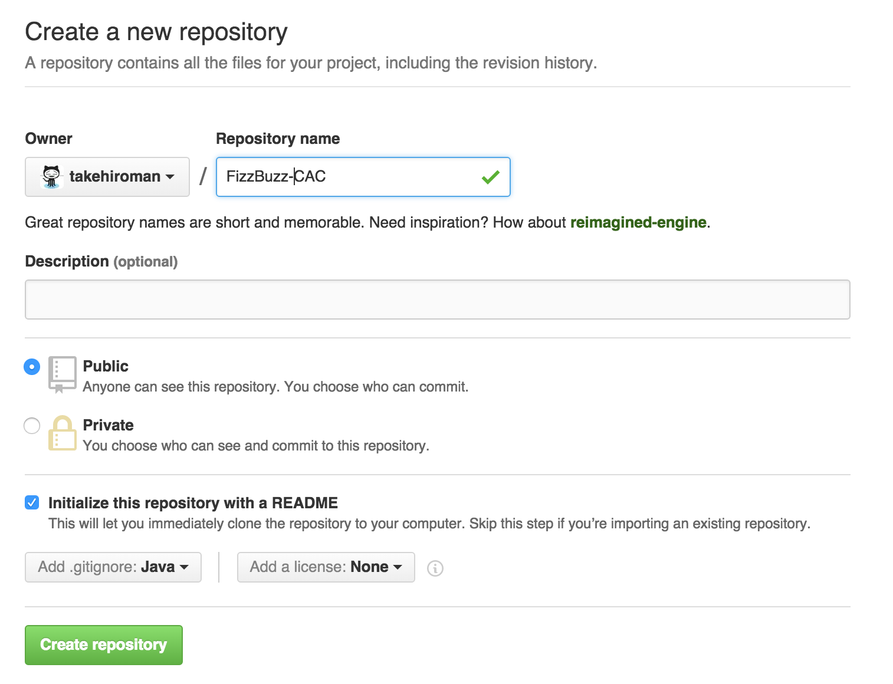
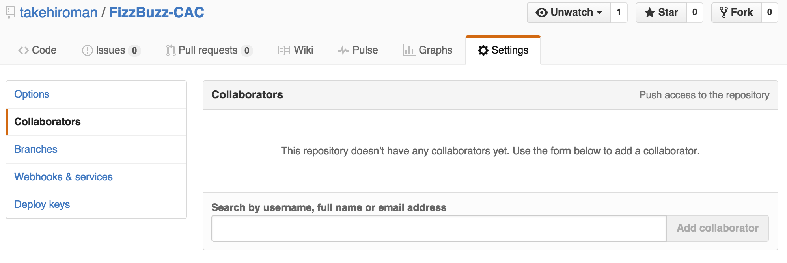
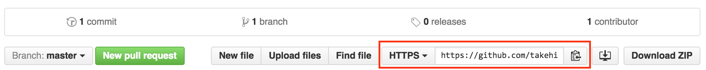

# リポジトリの作成
まずAさんには，開発するためのリポジトリを用意してもらいます。以下のような設定でリポジトリを作成してください。  
  
完了したら，「Create repository」を押します。次に作成したリポジトリにチームメンバーを加えます。SettingからCollaboratorsを選んでください  

そこに，チームのメンバーのGithubアカウント名を追加してください。すると，そのメンバーもそのリポジトリで作業することができます。次に，このリポジトリのURLをコピーして自分のローカル環境にcloneします。リポジトリのURLは以下の部分に書かれています  

ターミナルで以下のようなコマンドでcloneしてください
~~~
$ git clone コピーしたURL
~~~

リポジトリがローカル環境に保存されるので，そのリポジトリ内に移動し，JavaでFizzBuzzプログラムを作成してください。完成したら，以下のコマンドを入力しGithubに送信してください。
~~~
$ git add FizzBuzz.java
$ git commit -m "FizzBuzzプログラム作成"
$ git push -u origin master
~~~

これで，リポジトリの用意と，拡張するためのプログラムの用意が完了しました。

