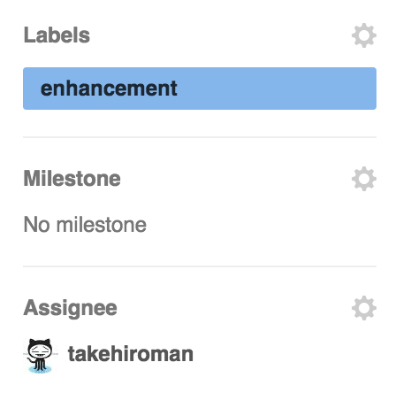

# チケットの発行
## チケット駆動開発とは

今回は，Githubのissueの機能をチケットと見立てて開発していきます。

## issueの発行
ここからはBさんの作業です。まずissueでチケットを発行してください。issueタブでNew issueを選択します  

次にissueに追加することを書きます。書き終わったらsubmit new issueでissueを発行します。

書き終わったら，右にあるlabelsでenhancement(拡張)を選択し，誰が拡張するのか(自分)を選択してください

## ブランチの作成とソフトウェアの拡張
ブランチを作成して，そのブランチ内で機能を追加しましょう。以下のコマンドを入力してください  
~~~
git branch 1
git checkout 1
~~~
今回ブランチ名は，issueの番号と関連つけるため番号にします。作成したブランチで，2,3,5の倍数でGithubを表示する拡張を行ってください。完了したら以下のコマンドを入力してください
~~~
git add FizzBuzz.java
git commit -m "refs #1 2,3,5,の倍数でGithubを表示"
~~~
コミットメッセージに「refs #"issue番号"」とすることでissueの内容と関連つけることができます。

