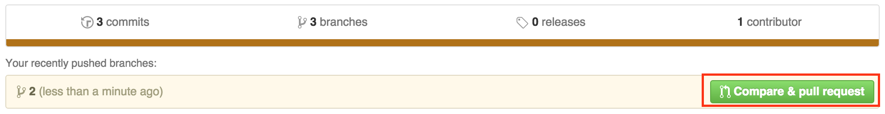
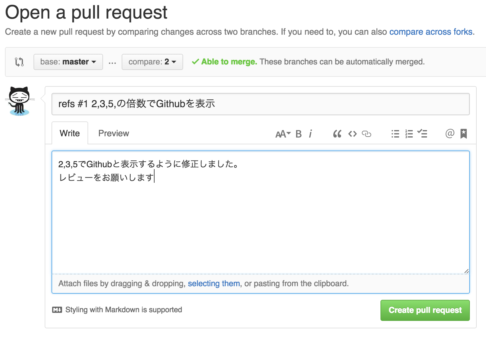

# Pull Requestとは

Pull　Requestとは，修正したプログラムを元のプロジェクトにパッチとして送信します。元のプロジェクトを管理する人は，このPull　requestを見ていきコードに品質を上げるものであればその修正を取り入れていきます。オープンソースプロジェクトでは，このように世界中の色んな人がPull Requestを送ることで，ソフトウェアの品質を上げています。

先ほど作成したブランチをGithubにpushします。以下のコマンドで「1」のブランチをGithubにpushしてください。
~~~
git push -u origin 1
~~~  
ブランチをpushすると，Github上に以下のようなボタンが表示されます。このCompare & pull requestをクリックしてください。  

すると以下のようなページに移動するので，どのような修正したのかやレビューの依頼をコメントに書いてください。OKなら「Create pull request」を押してPull requestを作成してください。  

