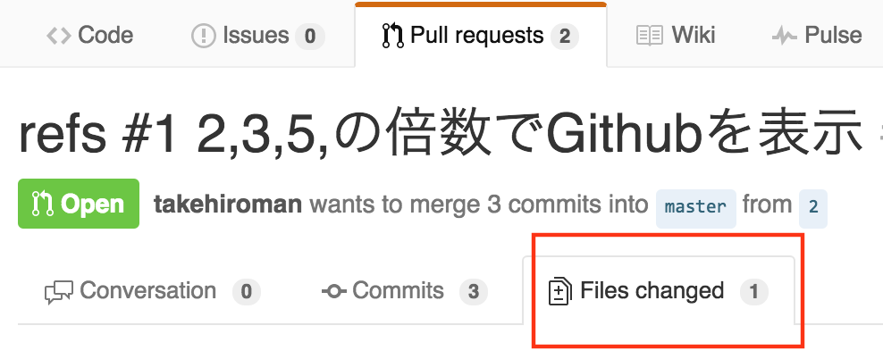
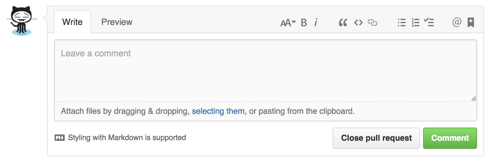
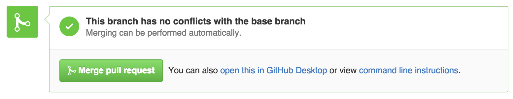

# コードレビュー
コードレビューでは，修正されたPull Requestが説明された内容と一致しているか，バグが含んでいないかを確認します。レビュー方法は，以下のようにFile Changesで変更内容を確認する  

または，変更したブランチを取得して正しく動作するか確認してもらいます。以下のようにブランチをpullし，移動して確認してください。
~~~
$ git pull origin 1
$ git checkout 1
~~~
もし問題があれば，以下の部分にどの部分に問題があるのか，どんな問題が発生したのかをコメントしてください。

問題がなければ，問題がなかった報告をしてください。うちの研究室ではLGTM(looks good to me.)というGitHubのプルリクに対するOKコメントを採用しているのでそれで出してみましょう。LGTMはたくさんの画像,gifが作成されているため，そこから選ぶのも良いです。  

LGTMをまとめたサイト  
[LGTM.in](http://www.lgtm.in/browse)

例　　

Markdownでは以下のような記法で書くと画像が表示されます
~~~

~~~

LGTMを出したら以下のボタンでプルリクをmasterブランチにMergeしてください  

Mergeが完了したら，AさんもBさんも最新のmasterブランチをgit pull origin masterで取得してください。これで2,3,5での倍数でGithubと表示する機能を拡張したソフトウェアが完成しました。